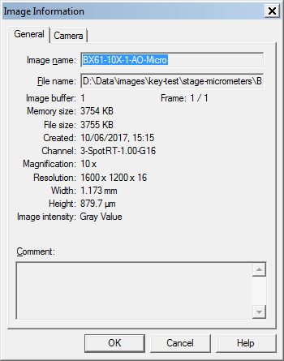

[Back to ImageJ](ImageJ.html)

I had recorded an image on the Olympus BX-16 microscope at 10X. The metadata
from the original image is shown below.



The image (reduced to 8 bits/pix) is shown below.


After cropping the image to measure just the large divisons and applying an
automatic threshold to segment the lines I obtained the image below.


An enlarged view of the first two lines is shown below.


The measurement data was stored to a `.csv` file for analysis.

Let's read in the data


```r
df <-read.csv2("tif/stage-micrometer/BX61-10X-1-AO-micro.csv", sep=',')
library(knitr)
kable(df)
```


 ID   Area   Mean   Min   Max  XM         YM     
---  -----  -----  ----  ----  ---------  -------
  1    147    255   255   255  172.983    13.704 
  2    129    255   255   255  310.438    13.453 
  3    140    255   255   255  447.214    13.550 
  4    176    255   255   255  583.455    13.580 
  5    135    255   255   255  720.433    12.796 
  6    145    255   255   255  857.769    13.521 
  7    130    255   255   255  994.500    13.000 
  8    146    255   255   255  1131.829   13.356 
  9    135    255   255   255  1268.389   12.848 
 10    137    255   255   255  1406.128   12.945 
 11    131    255   255   255  36.210     14.233 
 12      1    255   255   255  1263.500   1.500  

Note that the area of the last measurement is 1 pixel. This is spurious. We need
to filter out the last row.

We can do this using base R as shown below


```r
df_good <- df[df$Area>1,]
kable(df_good)
```


 ID   Area   Mean   Min   Max  XM         YM     
---  -----  -----  ----  ----  ---------  -------
  1    147    255   255   255  172.983    13.704 
  2    129    255   255   255  310.438    13.453 
  3    140    255   255   255  447.214    13.550 
  4    176    255   255   255  583.455    13.580 
  5    135    255   255   255  720.433    12.796 
  6    145    255   255   255  857.769    13.521 
  7    130    255   255   255  994.500    13.000 
  8    146    255   255   255  1131.829   13.356 
  9    135    255   255   255  1268.389   12.848 
 10    137    255   255   255  1406.128   12.945 
 11    131    255   255   255  36.210     14.233 


[Back to ImageJ](ImageJ.html)
