[Back to ImageJ](ImageJ.html)


# Introduction


This part of the workshop uses a data set of five images available from
[here](https://workshops.imagej.net/). Download the file
`images/C3-jw-30min.zip`. The origin of this data set is explained
[here](https://data.broadinstitute.org/bbbc/BBBC020/).

The authors suggest a citation:

> We used image set BBBC020 from the Broad Bioimage Benchmark Collection
> [Ljosa et al., Nature Methods, 2012].

The PDF is archived [here](pdf/lejosa2012a.pdf) with a [bibtex](pdf/lejosa2012a.bib)
entry.

## Don't get bit...

File parameters in scripts need this type of syntax:

```
#@ File (style="")  imageFile
```

without the `(style="")` they throw an error.

# General Comments

Ellen notes that there is no "one right way" to segment because images are
different. The key is to choose what works best and is reproducible. Scripting
and good documentation are especially important for reproducible analyses. This is
analogous to having a well documented protocol for specimen preparation.

During pre-processing steps one corrects for noise, smooth edges of the objects,
normalize the background. The goal is to increase the contrast of the objects
you want to be able to easily differentiate the objects from background.
**JRM note: this is much easier _said_ than _done_**. We want good contrast
and signal/noise ratio between the objects and background. We will set a gray
level threshold to distinguish between the background and our objects.

To accomplish this one can apply different filters, for example a median filter
to reduce noise, Gaussian filters are useful for smoothing background but it
does not preserve edges. To study object shape one needs to preserve edges: a
[Sobel edge detector](https://imagej.nih.gov/ij/docs/guide/146-29.html#sub:Find-Edges)
or a [Kuwahara filter](https://en.wikipedia.org/wiki/Kuwahara_filter) are
good at preserving edges.

# The Process

1. Open the image 5 using Bioformats to preserve the metadata. (1:26:12)

2. Change to gray scale (LUT > Grays) (1:26:19)

3. Sometimes we make mistakes in trial processing. Not all commands work with
the "Undo" button. Ellen works on Duplicates ( **Shift CMD D** ) as she goes
(1:27:02). I named this image "work".

4. Try a Gaussian Blur (GaussianBlur... in search) to smooth out the features
inside the nuclei. Use the default (2 px) for now (1:27:41).

5. Next we threshold (Threshold...) and check the Dark Background. Use the
`Default` threshold for now. The Default is a small variation on `Otsu` and
generally works well. (1:29:10)

6. In the Command Finder we want `Create Mask`. Note that this makes a
**binary image** named `mask`.  Note in IJ binary images are still
8 bits/px but only have 2 gray levels: either 0 or 255. (1:29:25)

7. `Duplicate` to play with mask. Accept the default name (mask-1). In this 
image we only have morphology information - shape and size. One can apply
morphological operators to the mask (i.e. `erode`, `dilate` which will shrink or
grow your object 1 px at a time.) Combinations of these will help smooth the
boundaries. It can get rid of small structures and fill holes. You can open/close
to smooth boundaries and then fill holes. (1:31:10)

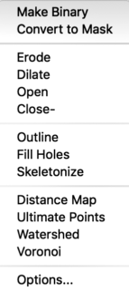

Then there is `Watershed` we will use today. Watershed is used to separate closely
touching objects. Note the touching particles from the bottom of our mask-1
image:

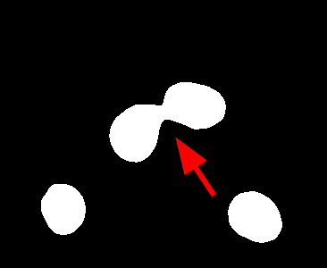

We will use watershed to separate them. It works best on circular objects (1:31:39).
It is searching for the concavity between the two and will draw a border between
them at the minimum separation between the objects.

8. In the command finder type `Watershed`. The algorithm separates the touching
features (1:31:55).

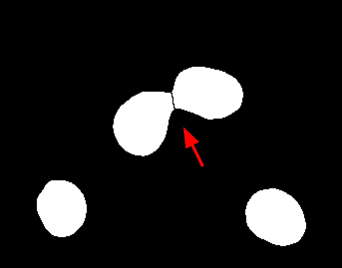

9. Now we can measure our particles. We will use a tool called
`Analyze Particles...`. We will duplicate the watershed image before starting,
naming it `after-watershed`. We have a size feature  - in px^2^ and circularity.
We can set a 200 px^2^ minimum size and will not filter on circularity. We will
also select `Add to manager` to save the detected ROIs. We will also exclude on
edges. Ellen does this most of the time. In this case note that one of the
particles at the top is badly clipped. This is why one wants to exclude
these types of particles. Now we run it and flatten the image to add
the particles to the overlay (1:34:32).


The ROIs are still saved in the ROI manager.

Note that there is an `Extended Particle Analysis` with more filters

10. Measure ROIS

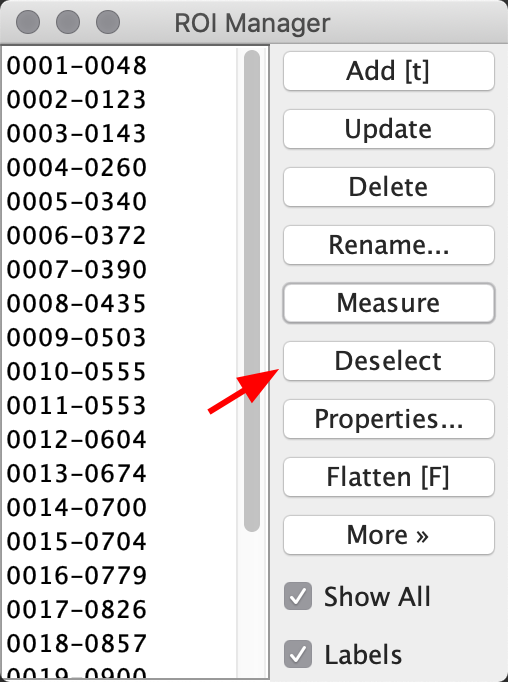.

Activate the ROI manager and press `Deselect` to make sure we do not have 
individual ROIs selected. This way we can measure all of them (1:35:46).
Then press `Measure`. We can save this to a .csv file,
[Image-5 ROI data csv file](csv/image_5_rois.csv).

**Note** - Because we measured the **binary image**, we cannot get the gray
level from the ROIs. They are all 255 - white. This is OK if all we care about
is **area**. But sometimes we need gray level information.

The solution is to **_overlay the ROIs_ on the _original data-set_**.

- Bring the original image to the foreground

- In the ROI manager press "show all" and toggle "Labels" and "Show All".

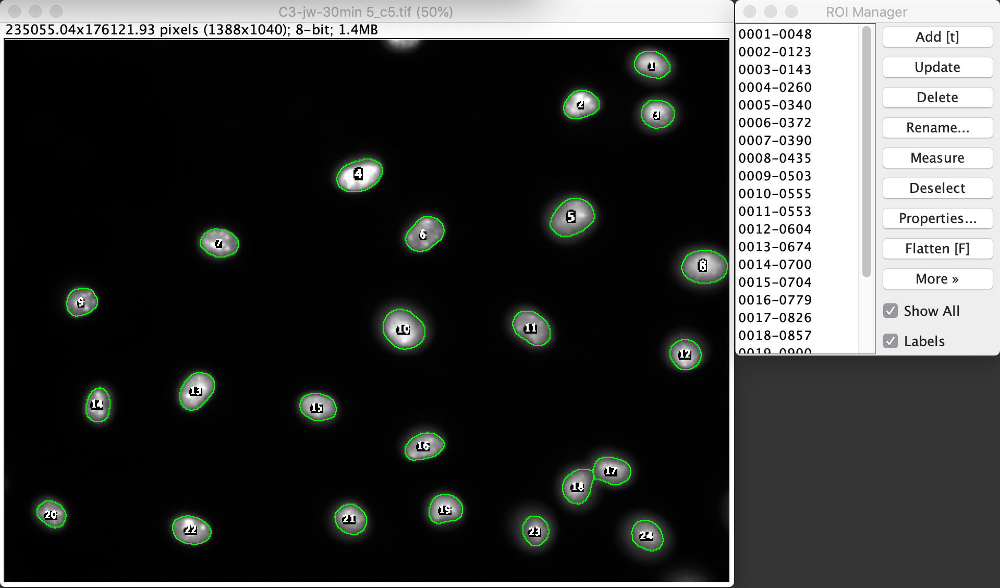

Later we will script this!

One can save a zip file of ROIs, In the option for "more" once can save a zip
file of the ROIs. Ellen saves the zip file of ROIs, her mask image, and the
binary mask she creates. (1:38:17)

**This lets you at a later date load the data back into the ROI manager and check
your results.**

# Other segmentation techniques

- [Active Contours](http://imagej.net/Level_Sets)

- [Graph-based methods](http://imagej.net/Graph_Cut)

- [Machine Learning](http://imagej.net/Trainable_Weka_Segmentation)

# Examples

## Touching spheres

[The ImageJ Forum](https://forum.image.sc/t/segmenting-circular-objects-that-are-touching-multiple-other-objects/1489)

These are similar to touching latex spheres

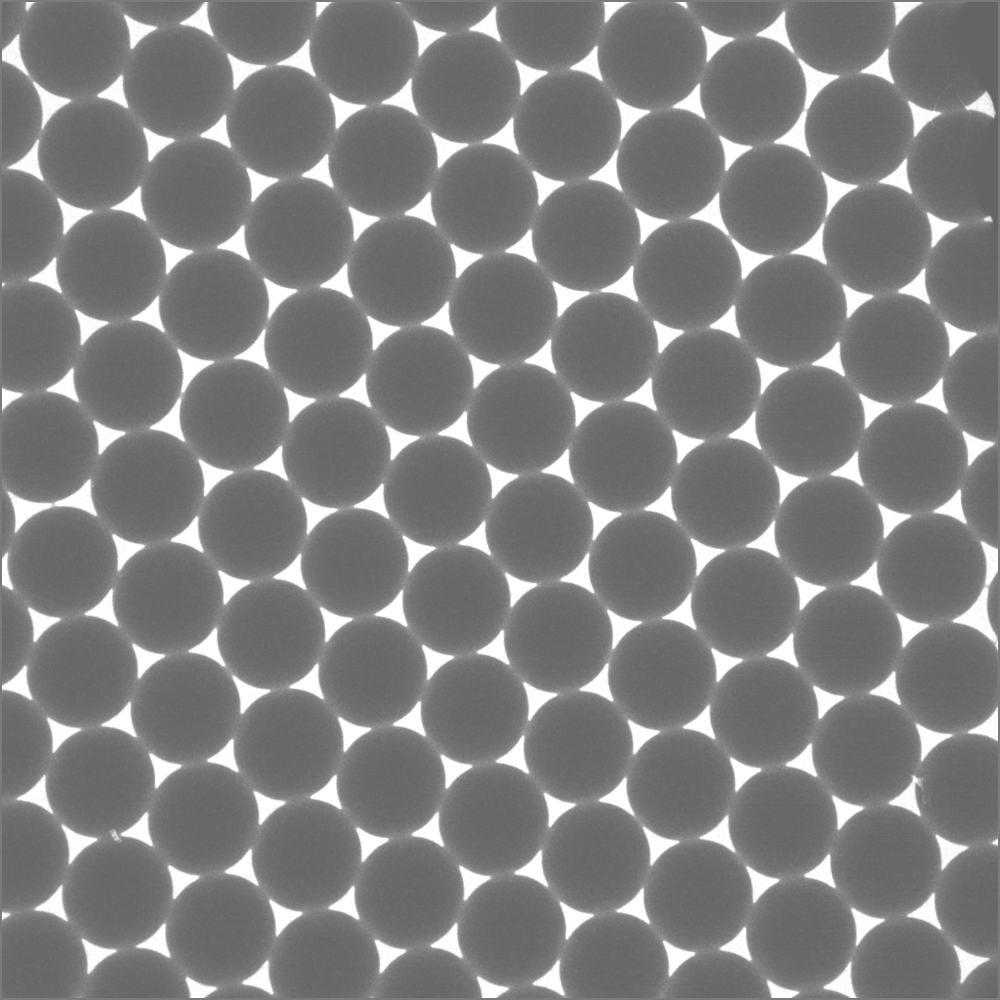. Zooming in there is what
looks like surfactant where the spheres are touching.

Contrast is reasonable, so we can duplicate and go straight to segmentation

1. Set Threshold. We have a light background (turn off **dark**) and use the
default and convert to a mask. (1:42:16)

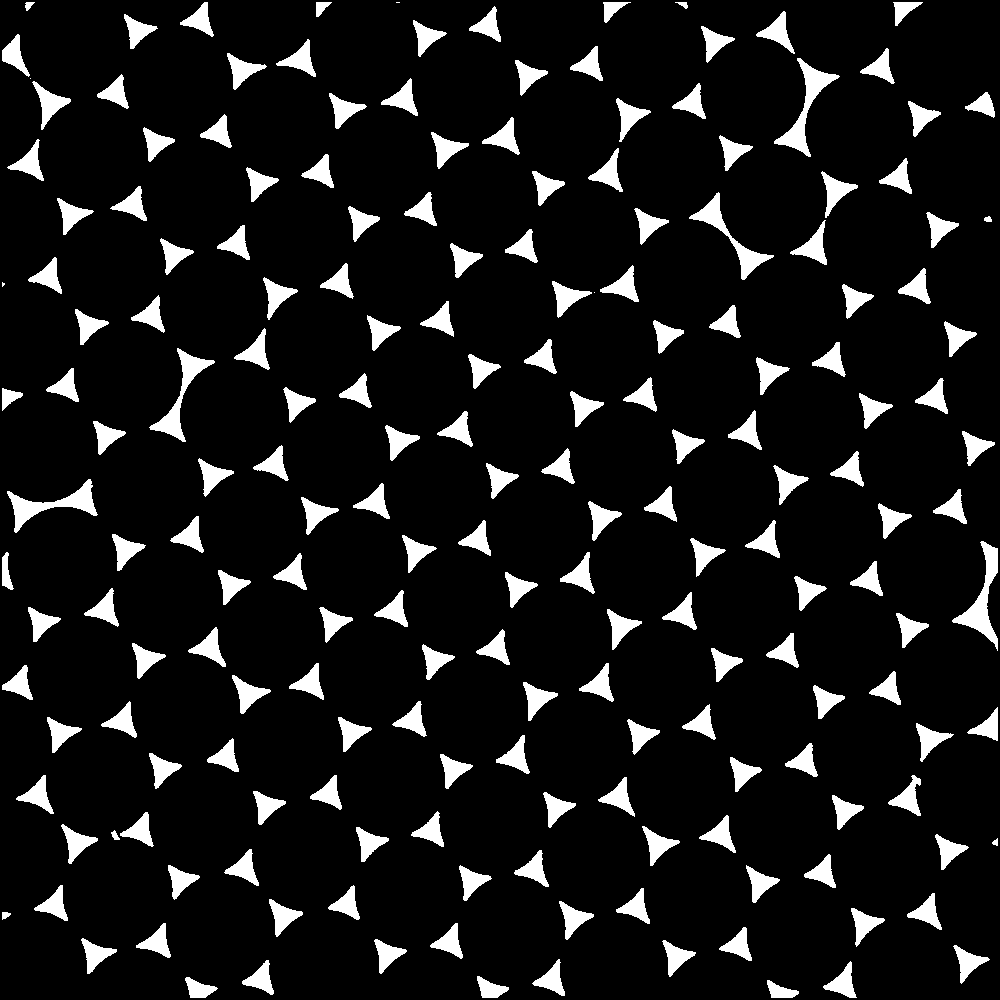

2. Run the Watershed. A pretty decent segmentation.

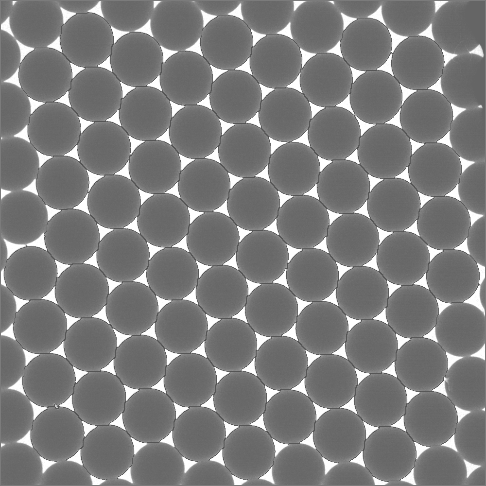

3. Analyze Particles. We can deselect and run on just single particles away 
from edge,


Can find maxima 

# Skeletonize

From [here](https://forum.image.sc/t/length-measurements-how-to-measure-length-of-biological-curved-structures/1424)

The image is a Termite digestive tube

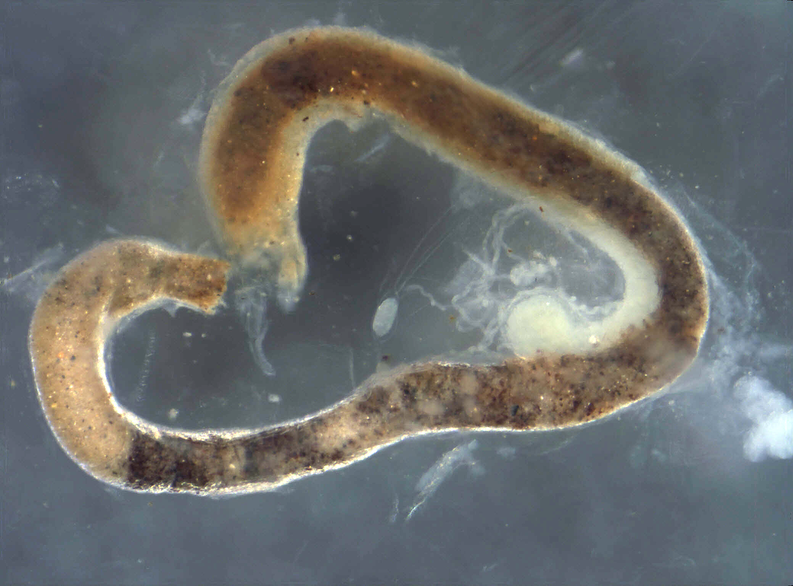

Starting at 1:46:34

By hand...

1. Drag & Drop image

2. Use Color Threshold...

- Set Dark background, HSB mode

- Set both Brightness and Saturation to the full range (0-255)

- Set Hue to 0 - 32, (pass 2: I like 0 - 40 better...) which gets the
yellow/red part of the spectrum.

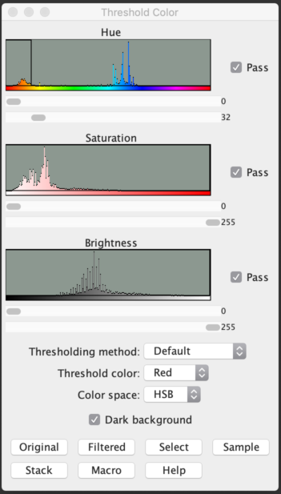. Make certain that the
pixels are not connected at the end.
   
- When happy select that object  (3rd from left, second line from bottom)

- duplicate ("work") the window and convert to mask. **_Note_**: I find this
tool very annoying. It seems to easily rest the brightness and saturation. Check
these before `Convert To Mask`. Duplicate the mask, again to be safe...
(1:49:12)

- preparation for segmentation: We need the tube to be filled in. Skeletonization
will find the middle of the tube. It will put out perpendicular lines to find
the boundary. First we need to fill in holes and can use binary operations.
First run `Fill Holes`. Then `Dilate`, `Fill Holes`, `Erode`.

- Run `Analyze Particles`. Set the bottom size to 1000 px., check 
`Exclude on edges` and `Add to Manager`, and then `OK`. Our tube shows
up in the `ROI Manager`. Now we can `Skeletonize`. A copy of the image
is flattened and shown below.

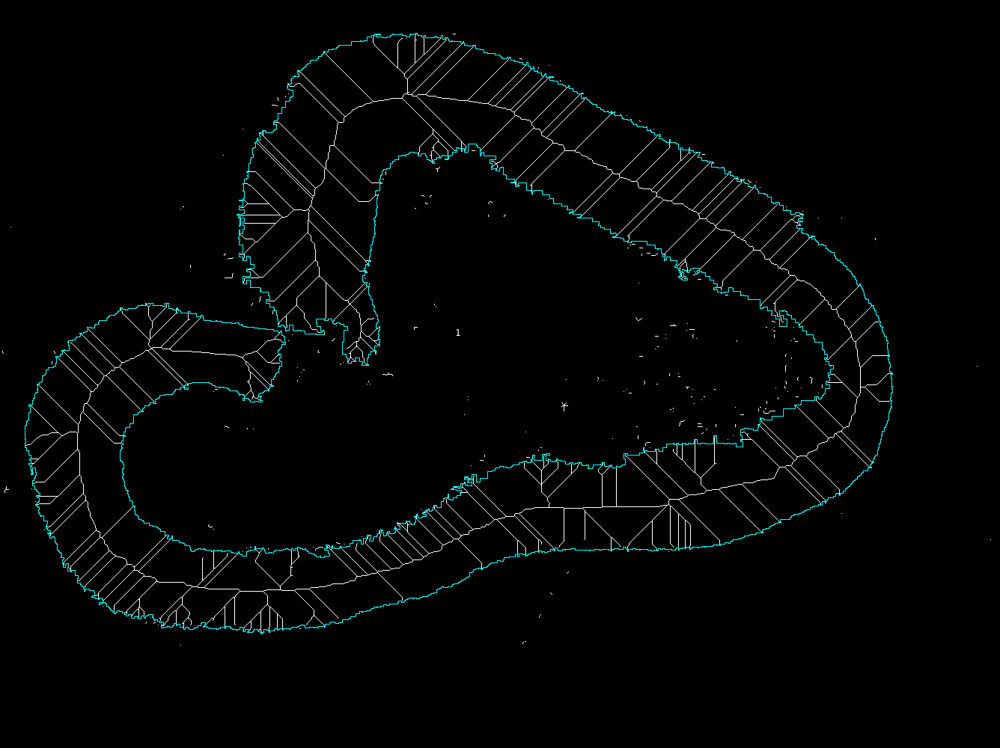
The central line is the longest, shortest path for the object. We can run
`Analyze Skeleton(2D/3D)` and select `Calculate longest-shortest path`. This
prints out the length in the `Results Table`. The value is 3164.106 (px?)

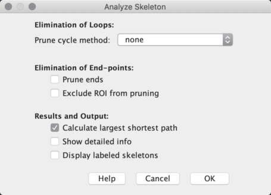


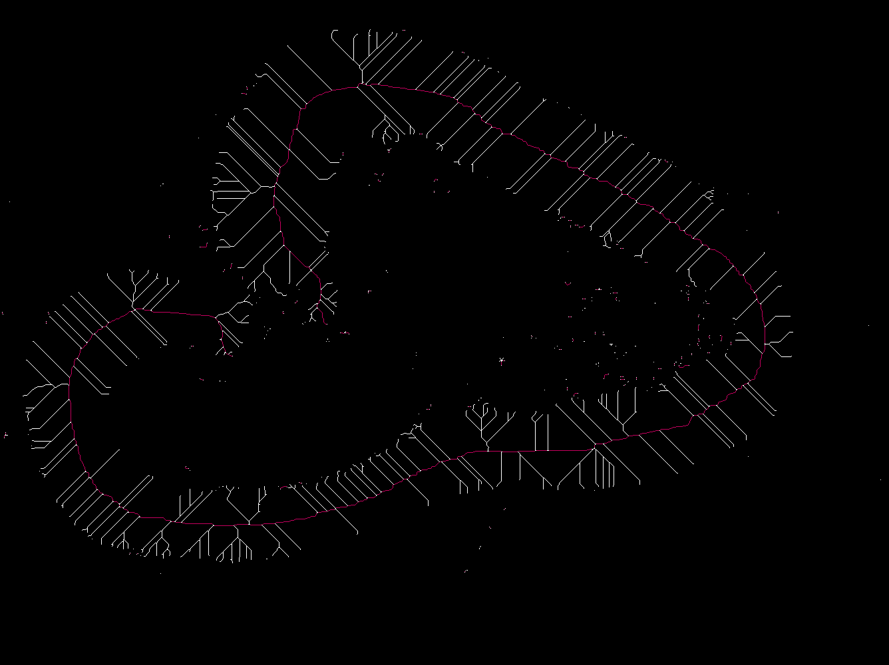

(1:51:39). It is all macro-record-able...

This was the answer the user needed.

# Background subtraction

Image has elliptical cells and bubbles and an uneven background.

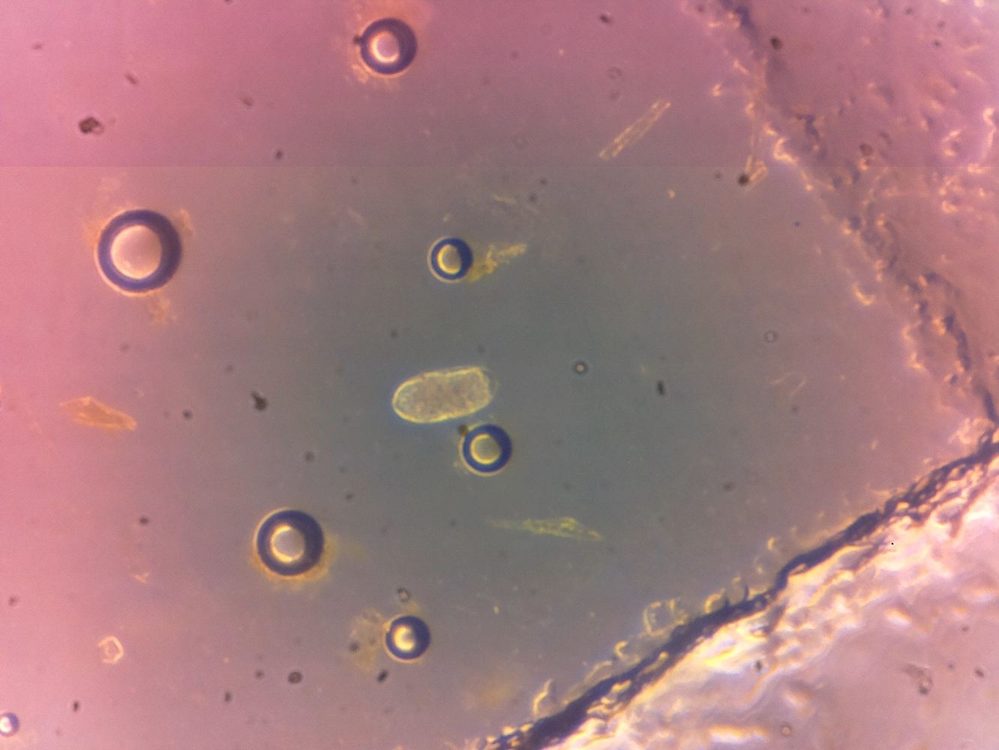

Ellen noted that the  Rolling Ball can do some strange things to images and
recommends **not to use** the `Subtract Background...` method because the
rolling ball can do strange things to images (1:58:00), especially images
with jpg compression. **N.B.** The uneven background can be badly rendered
in jpg images. See the image with expanded contrast

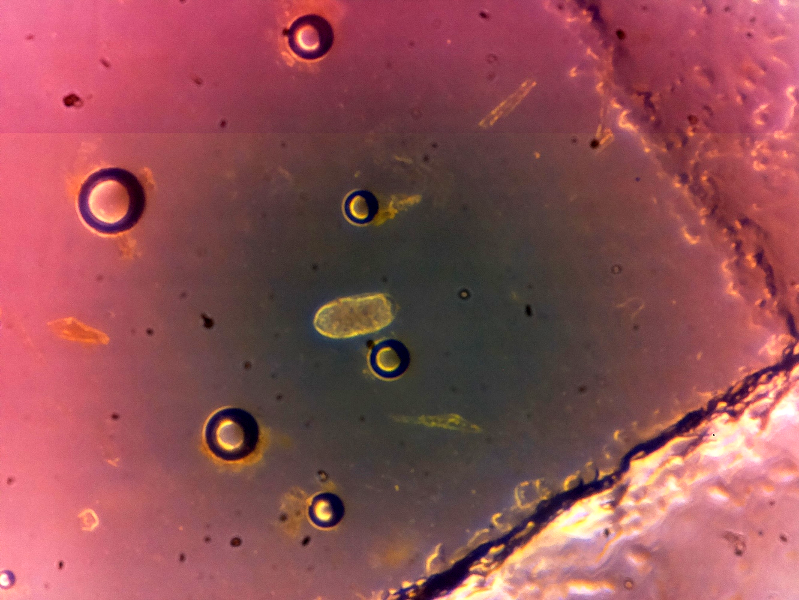

1. Duplicate the image. For a `Gaussian Blur`, one wants to select a size that
is roughly 30% of the image size. Then use `Image Calculator` to subtract the
blurred image and create a 32 bit image. It looked still JRM Q: Why not divide?

**Note**: I scripted a background subtraction using division and came up with:

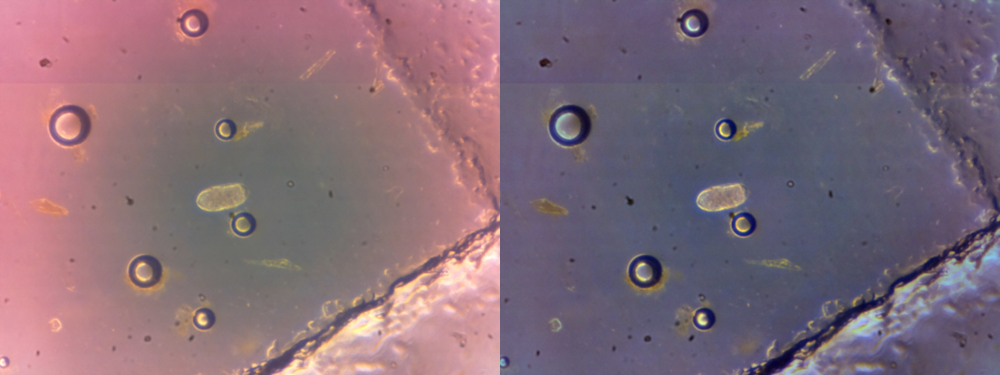

My script is [here](py/cells_and_bubbles_rgb_bks.py).

[Back to ImageJ](ImageJ.html)
