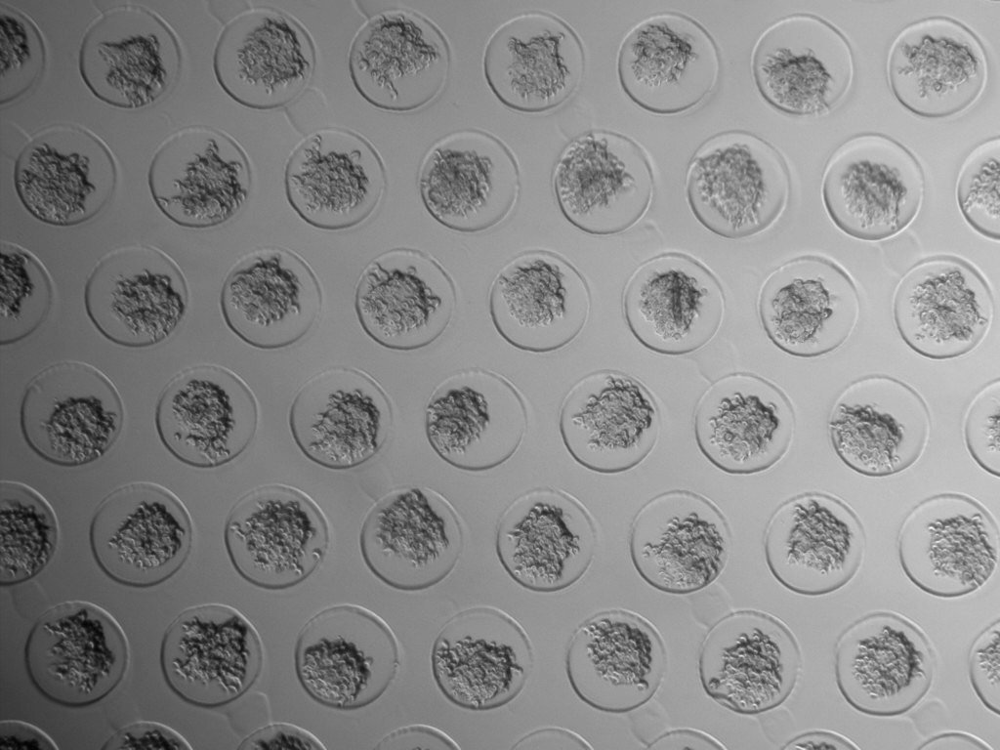
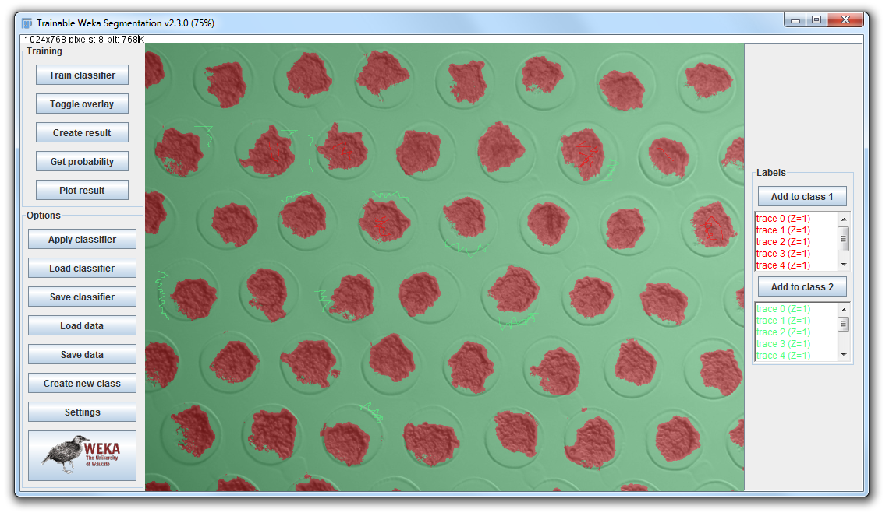
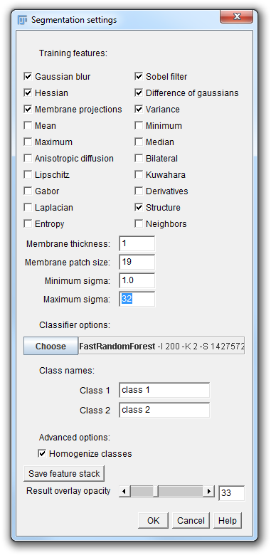
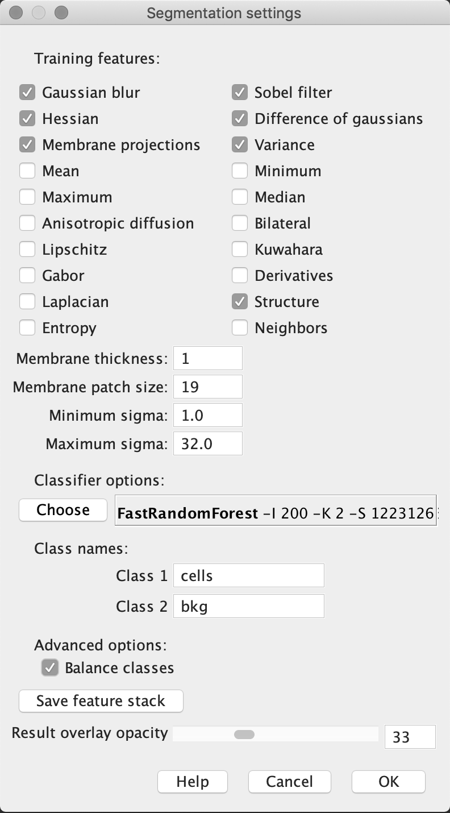
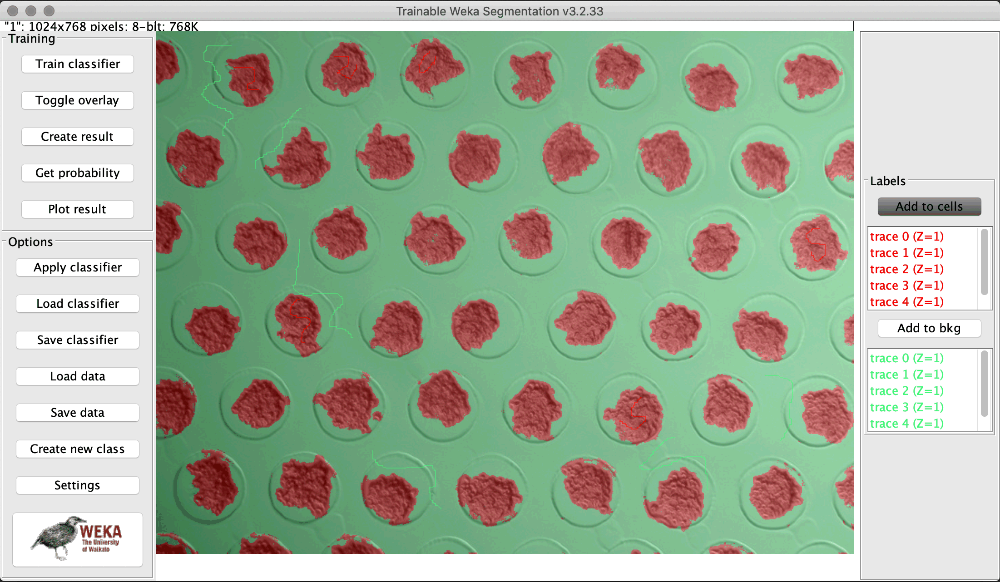

[Back to ImageJ](ImageJ.html)


# Introduction

This example came from a
[Forum post](https://forum.image.sc/t/analysis-of-aggregates/303)
by a user who was having difficulties segmenting the image below.
Ellen Arena used this as an example in this 
[video](https://vimeo.com/218520761#t=1h11m44s). The method uses the
[Trainable Weka Segmentation](https://academic.oup.com/bioinformatics/article/33/15/2424/3092362)
plug-in which uses machine learning to train a classifier.

Ellen explains the difficulties:

1. We can see the aggregates and can also see that there is a shadow from the
micro-wells that could cause a problem. There is also a shadow across the image.
It is darker in the upper left.... 

2. The user trains the system with part of your input data, teaching the
classifier  what to segment. The results may be applied to multiple images.
The user benefits from the algorithms included in the package.

3. The output is a labeled result based on the data training set used to train
the model.



# The problem explained

The user explains the problem:

> I seeded cells in microwells to measure the difference in aggregation.
> Pictures were taken through a microscope. Now I want to analyze the size of
> the aggregates. Therefore I want to **outline the clump of cells** then to be
> able to analyze them. I have to repeat this for every clump in the picture.
> (I have many many more pictures to go through...) I started drawing the
> outlines with the freehand tool (JRM: **ugh!**), but I would want to automate
> this process. **The wand tool is way too rough and imprecise**.
> I’m still a beginner, I have not much of a clue how imageJ exactly works.
> (JRM: an honest user...) If someone of you could help me further, I’d be
> incredibly grateful.

# Trainable Weka proposed

Jan Eglinger suggests an approach that uses
[Trainable Weka Segmentation](https://imagej.net/Trainable_Weka_Segmentation)

In in Fiji one finds it in:

> ```
> Plugins > Segmentation > Trainable Weka Segmentation
> ```

Jan tried and got the following result:



using


# Curtis Reuden summarizes the approach

> I know it’s been a long time since this thread. But just to follow up:
> 
> > Could you explain me your reasoning why you change those parameters? So I
> > can gain insight in the parameters?
> 
> In general, I presume @imagejan has carefully reviewed the
> [TWS documentation](http://imagej.net/Trainable_Weka_Segmentation) which 
> explains all those options, and has used it enough to have an intuition for
> which features are suitable in different scenarios.
> 
> The docs are pretty math-focused and less intuition-based, but you can
> probably get a feel for how the classification is working by trying different
> combinations of features with the `Train classifier` button on a small image.
>
> I fuzzily recollect that [@iarganda](https://forum.image.sc/u/iarganda)
> eventually plans/hopes to make some kind of feature browser, so that you
> can preview the training results with different combinations of features.
> In general, the combinations are exponential, but it would be doable to at
> least show a preview of a few commonly useful combinations on a small
> window of data.
> 
> > Any tips on maken macro’s with this?
>
> See the
> [TWS documentation on macros](http://imagej.net/Trainable_Weka_Segmentation#Macro_language_compatibility)
> for instructions.

# Ellen Arena walks us through the steps

1. Load the image

2. Start `Trainable weka Segmentation`

3. We will have two labels: `cells` and `not-cells`

4. Open `Settings` (lower left corner)

5. Set the settings. The image below shows the current choices selected

    
    
    Note: make sure to turn off using SCIFIO in the `Edit > Options > ImageJ2`
    menu to prevent getting a 4 image stack instead  of an RGB image with a
    screen shot. That was **really** annoying!
    
    
    
6. Run the classifier. The image below shows the segmentation

    

# Other examples

The [web site](https://imagej.net/Trainable_Weka_Segmentation) has a nice
leaf example. The code is also archived [here](ijm/tws_leaf_example.ijm).

There are other scripting examples [here](https://imagej.net/Scripting_the_Trainable_Weka_Segmentation).


[Back to ImageJ](ImageJ.html)
