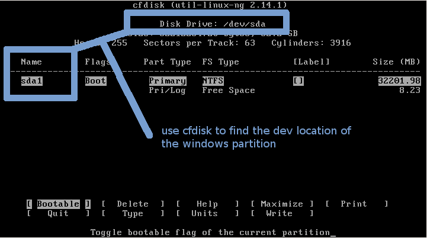
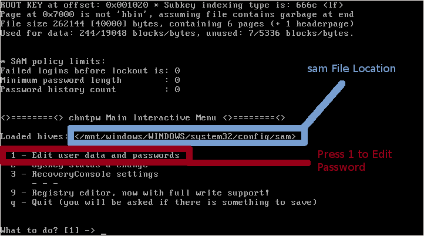
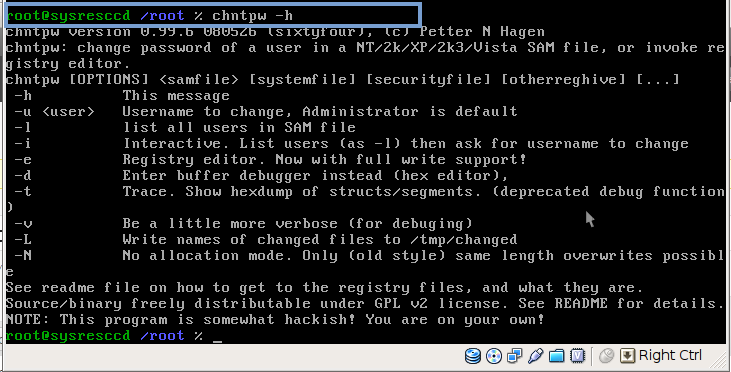
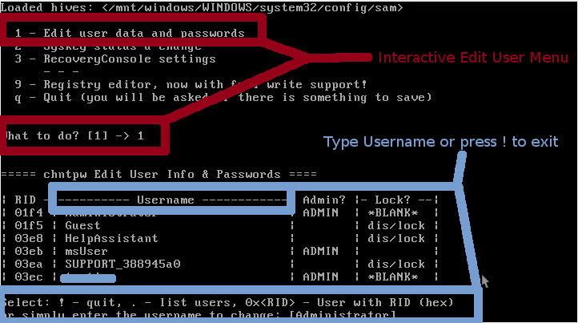
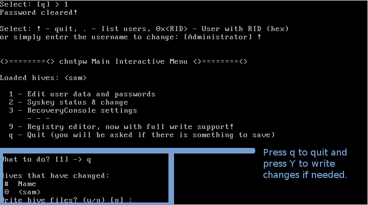

Brief chntpw Tutorial
========================================================


[Back to Index](../README.html)

From [here](http://whatisgon.wordpress.com/2010/01/28/chntpw-tutorial-resetting-windows-passwords-editing-registry-linux/)

This tutorial describes the basics of using chntpw,
which is included on the SystemRescue CD.

SystemRescueCd is a Linux Live CD that is based off of 
Knoppix Linux. It includes a number of extremely useful 
utilities for recovering data and fixing a broken machine 
that is running Windows or Linux. In addition to a number 
of useful command line tools, the SystemRescue CD also 
includes an X environment, where you can use graphical 
tools such as Firefox and gparted.

For those not familiar with it, chntpw is a Linux tool that 
can be used to edit the windows registry, reset a users 
password, and promote a user to administrator, as well as 
several other useful options. Using chntpw is a great way 
to reset a Windows Password or otherwise gain access to a 
Windows machine when you don’t know what the password it.

Using chntpw is pretty straightforward, especially if you 
use interactive mode.

## Mounting the Windows Hard-Drive

First, boot the SystemRescue CD, or other Linux Live CD.



1. Mount the windows partition. If you don’t know what 
device it is on, you can use the cfdisk command and it will 
tell you the device. The device should look something
like

```
/dev/sda1
```

Mount the partition using the ntfs-3g or mount command:

```
ntfs-3g /dev/sda1 /mnt/windows
```

OR:

```
mount -t ntfs-3g /dev/sda1 /mnt/windows
```

## Locate the Windows SAM File



2. Now, to make it a little easier, go ahead and switch to the location of the Windows Sam file and other hive files.

```
cd /mnt/WINDOWS/system32/config
```

**Note that in Windows Vista or Windows 7, the physical 
registry location is in ``System32`` with a
capital ``S``**

## To blank out or change the Windows password:



3. Type ``chntpw -h`` to familiarize yourself with
the different options and usage of chntpw. If you like, you 
can actually use ``chntpw`` by giving it the
appropriate option, but I like to use interactive mode, 
which makes it a little easier.

In addition to any options, you also have to give chntpw 
the location of the windows sam file, which stores the 
passwords, or the registry hives that you want to edit, 
which should all be in the config folder (Instead of 
WINDOWS, NT uses WINNT.)



4. Use the ``-i`` option to start chntpw in interactive 
mode and make sure to specify the name of the Windows sam 
file, as well as any other registry hive files you want to 
edit.

```
chntpw -i sam
```

Press ``1`` to edit the user password and then type the 
name of the user that you wish to edit and press enter.

You will now be given the option to blank out the password 
by pressing ``1``, as well as several other ways to change 
the user, such as upgrading their account to an
administrator.

Press ``!`` to exit the Edit User Screen and then
press ``q`` to exit chntpw and you will be prompted
to save any changes.

## Editing the Windows Registry

In interactive mode, you can also edit the registry by 
loading the correct hive files. These are in the system32 
config folder described above in the **Locate the
Windows SAM File*

Press ``9`` to edit the registry and then you can use 
commands like ``cd`` and ``ls`` to navigate the registry. 
For more options, press ``?``.

## Saving Changes and Rebooting



5. Once you are done making changes, you need to exit from 
the main chntpw menu and press ``Y`` to write the changes 
or ``N`` to ignore the changes.

Finally, unmount the drive and reboot:

```
umount /mnt/windows
reboot
```


[Back to Index](../README.html)

